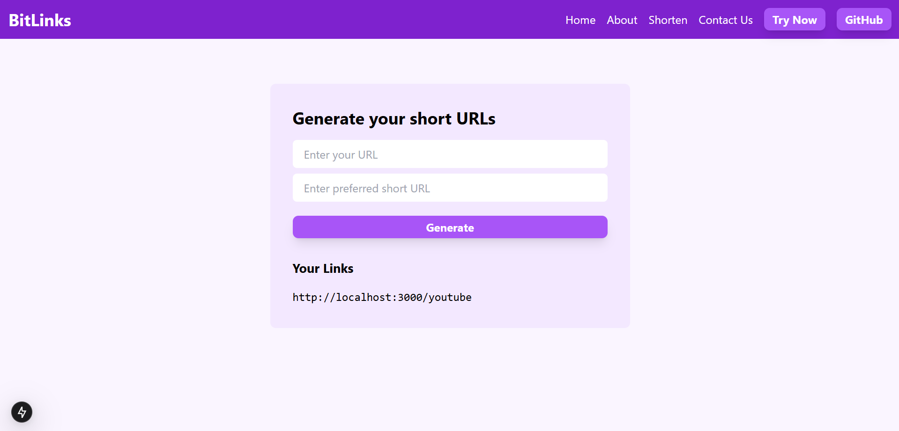

# 🔗 BitLinks - URL Shortener Application




BitLinks is a sleek and efficient **URL shortener** web app built with **Next.js** and **MongoDB**. It provides a fast, user-friendly interface to generate shortened URLs and track their usage — ideal for content sharing and link management.

---

## ✨ Key Features

- 🔗 Instantly generate short URLs from long links  
- 🔁 Seamless redirection using dynamic short codes  
- 📊 Track and store visit counts per URL  
- 🌐 Built-in serverless API routes with Next.js  
- 🎨 Clean, responsive UI powered by Tailwind CSS  

---

## 🛠 Tech Stack

| Technology   | Description                     |
|--------------|---------------------------------|
| Next.js      | React framework for SSR & APIs  |
| MongoDB      | NoSQL database via Mongoose     |
| Tailwind CSS | Utility-first modern styling    |

---


## ⚙️ Getting Started

### To run this project locally:


## 1. Clone the repository
```
git clone https://github.com/mr-coder-raj/BitLinks_NextJS-MongoDB.git
```

## 2. Move into the project directory
```
cd BitLinks_NextJS-MongoDB
```

## 3. Install dependencies
```
npm install
```

## 4. Set up environment variables
### Create a `.env.local` file and add the following:
```
MONGODB_URI=your_mongodb_connection_string
```

## 5. Start the development server
```
npm run dev
```
## Visit the app:
👉 http://localhost:3000

---

## 🚀 Example Workflow
Paste a long URL  

- Click Shorten  

- Get a unique short ID like bit.ly/abc123  

- Accessing that link redirects to the original one  

- Visit count is stored in MongoDB  

## 🧩 Future Enhancements
✅ Custom short link aliases  

🔐 User authentication (planned)  

📈 Analytics dashboard for links  

🌍 Public user profile with all links  

## 🤝 Contributing
Contributions are welcome!  
If you find bugs or have feature suggestions, feel free to:  

- Fork the repo  

- Create a new branch  

- Submit a pull request  

- For major changes, please open an issue first to discuss.   

## 📄 License
This project is licensed under the MIT License.  
Feel free to use, modify, and share with proper attribution.  

> Made with ❤️ by @mr-coder-raj
